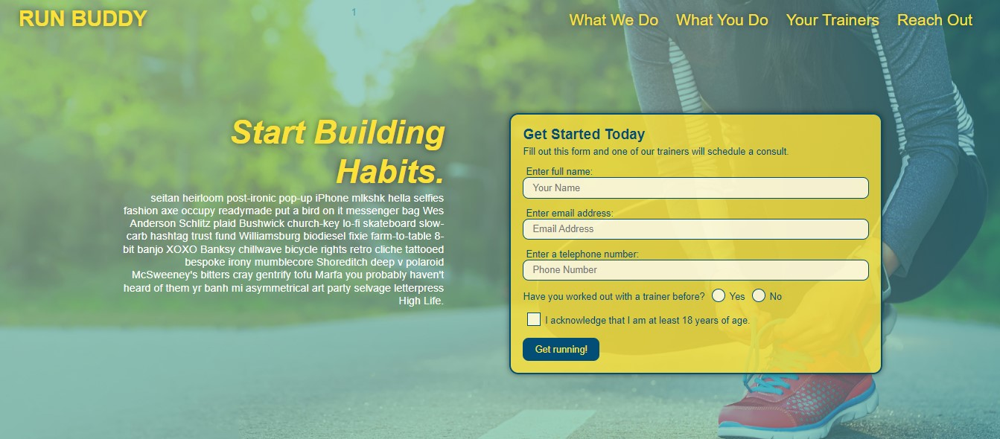

# Run Buddy

## Purpose
A front-end web application that offers fitness training services.

## Built With
* HTML
* CSS

### Application Demo

### Questions
GitHub Username: (kcaseychamberlain) 

View the project in GitHub at: https://github.com/KCaseyChamberlain/run-buddy

View the application live hosted at: https://kcaseychamberlain.github.io/run-buddy/

If you have any questions, contact Casey at: caseygchamberlain@gmail.com